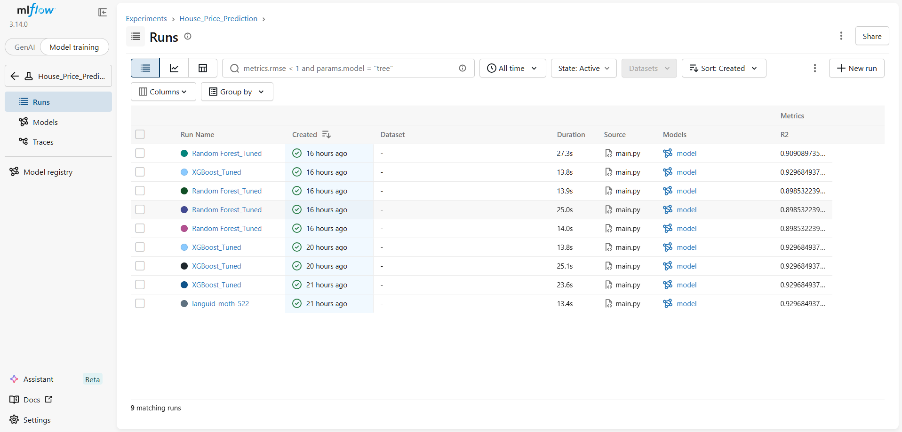
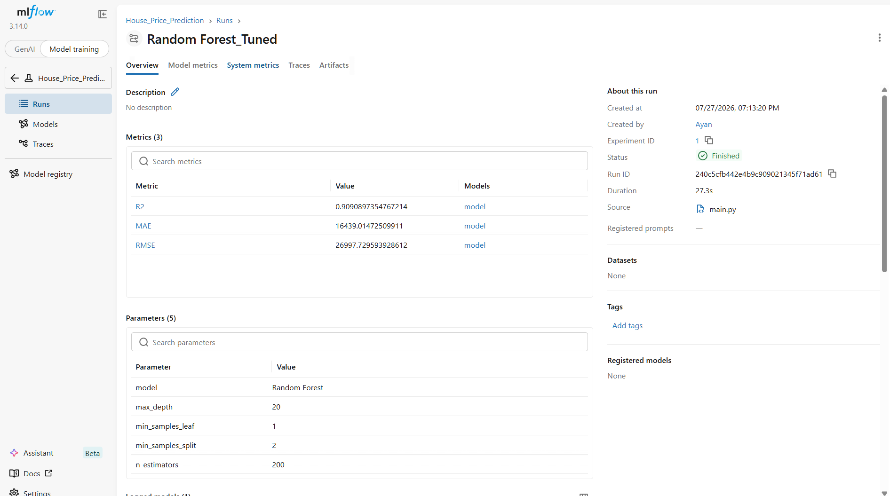
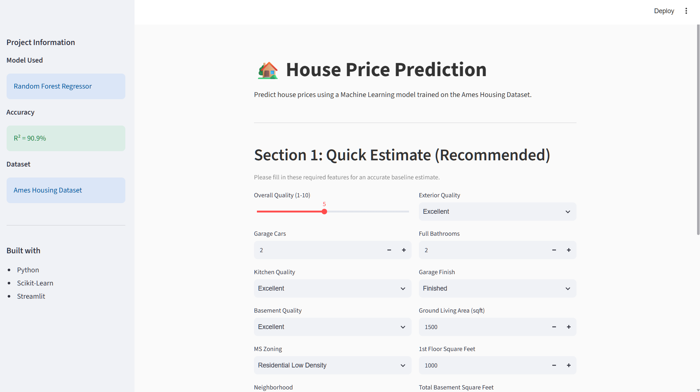
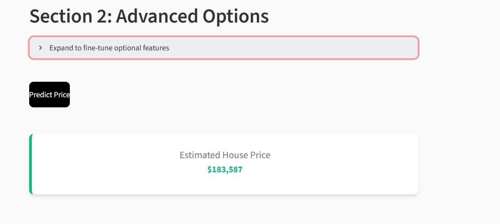

# 🏡 House Price Prediction

A complete end-to-end Machine Learning project to predict house prices using the Ames Housing Dataset. I built this project to cover the entire lifecycle of an ML application—from data ingestion and training to model tracking and deploying a clean, modern web interface.

## 🚀 Features

- **End-to-End Pipeline**: Modular code structure featuring Data Ingestion, Validation, Transformation, and Model Training.
- **Hyperparameter Tuning**: Automated search and evaluation of various models (Linear Regression, Ridge, Lasso, Decision Trees, Random Forest, XGBoost).
- **Experiment Tracking**: Integrated with **MLflow** to track metrics (R², MAE, RMSE) and log the best-performing models.
- **Modern Web UI**: A clean, minimal **Streamlit** dashboard allowing users to input house features and get instant price estimates.
- **Dockerized**: Fully containerized with Docker for seamless setup and deployment.

ML Flow dashboard


ML Flow statistics of the selected model


UI Website for user to input details about the house


Option to add 18 additional fields to get more accurate estimate of the house price


## 🧠 The Model

The final prediction model is a tuned **Random Forest Regressor**, which achieved an **R² score of 90.9%** on the test set. It uses 30 key features from the dataset (12 required, 18 optional) to generate highly accurate baseline estimates.

## 🛠️ Tech Stack

- **Python & Scikit-Learn**: Data preprocessing and model training.
- **MLflow**: Experiment tracking and model serialization.
- **Streamlit**: Interactive web interface.
- **Docker**: Containerization.

## 💻 How to Run

### Option 1: Using Python

1. Install dependencies:
   ```bash
   pip install -r requirements.txt
   ```
2. Run the Streamlit app:
   ```bash
   streamlit run app.py
   ```

### Option 2: Using Docker

1. Build the image:
   ```bash
   docker build -t house-price-app .
   ```
2. Run the container:
   ```bash
   docker run -p 8501:8501 house-price-app
   ```
